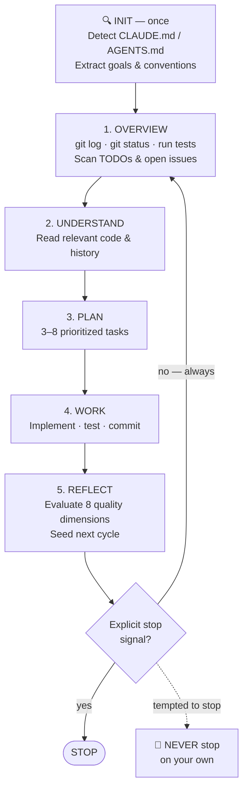

# ✊ AutoGrind Skill

**Tell your agent to start working. Walk away. Come back to finished work.**

AutoGrind is a skill for AI coding agents that makes them work continuously and autonomously; grinding through improvements, fixes, tests, and polish in repeating cycles until *you* say stop. No hand-holding. No "should I continue?" No stopping because the TODO list looks empty.

---

## The Grind Cycle



The agent evaluates 8 quality dimensions every Reflect phase — test coverage, error handling, docs, performance, UX, observability, security, code quality — so it always finds the next thing to improve.

---

## Use Cases

AutoGrind works for any long-running autonomous workflow — not just code.

### Go to bed. Wake up to finished work.

```
You:   autogrind this — i'm going to bed
Agent: [starts grinding]
       cycle 1 → fixed broken import, added 12 tests
       cycle 2 → documented all exported functions
       cycle 3 → reduced DB query count by 40%
       cycle 4 → added input validation, edge case tests
       ...
You:   [8 hours later] stop
```

AutoGrind runs unsupervised. No prompts. No check-ins. After each cycle it pauses 60 seconds for you to interrupt — then continues automatically.

### ML / data science

Point AutoGrind at a training script before you step away. It'll run experiments, inspect metrics, adjust hyperparameters, re-run, analyze results, and iterate — logging everything. Come back to a full experiment trail and improved model.

### Academic research

AutoGrind can grind through a literature review, structure an argument, fill in methodology gaps, expand on weak sections, and cross-check citations. Each cycle improves the manuscript; it stops only when you say so.

### Clean up a codebase while you're in meetings

Point it at a messy repo before your standup. It'll fix linting, improve test coverage, fill documentation gaps, and refactor the worst offenders — in priority order, with meaningful commits.

### Ship a feature end-to-end

Describe what you want in `CLAUDE.md`. Let AutoGrind plan, implement, test, and polish it while you work on something else.

### Design iteration

AutoGrind can iterate on designs, check for consistency issues, improve accessibility, and work through a revision backlog — any workflow where "keep improving until told to stop" is the right mode.

---

## Installation

### Claude Code

```bash
# 1. Clone this repo
git clone https://github.com/ttttonyhe/autogrind-skills.git
cd autogrind-skills

# 2. Symlink the skill (live updates from this repo)
ln -sfn "$(pwd)/autogrind" ~/.claude/skills/autogrind

# — or copy for a stable install —
cp -r autogrind ~/.claude/skills/autogrind
```

**Enable unrestricted tool use** so AutoGrind can run commands, read files, and commit without permission prompts on every action:

```bash
# In Claude Code settings, or pass the flag at startup:
claude --dangerously-skip-permissions
```

> Without this, AutoGrind will pause on every tool call. It technically works — but defeats the point.

**Invoke:**

```
/autogrind
# or: "autogrind this project"
# or: "keep working, don't stop"
```

---

### Codex

```bash
# Copy to the Codex skills directory
cp -r autogrind ~/.agents/skills/autogrind
```

Codex loads skills via the `activate_skill` tool. AutoGrind detects this and uses Codex-native task tools internally.

To run unsupervised, enable full auto-approval in your Codex config so tool calls aren't gated on confirmation.

**Invoke:**

```
activate_skill autogrind
# or say: "autogrind this project" / "keep working, don't stop"
```

---

### Gemini CLI

Add the skill content to your `GEMINI.md` (project root or `~/.gemini/GEMINI.md`), or reference it:

```bash
cp -r autogrind ~/.gemini/skills/autogrind
```

Then in `GEMINI.md`:

```markdown
# Skills
Use the AutoGrind skill from ~/.gemini/skills/autogrind/SKILL.md when asked to work continuously.
```

Run Gemini with full tool permissions so it can execute commands without interruption.

**Invoke:**

```
gemini "autogrind this project — don't stop until I say so"
```

---

### OpenCode

Copy `autogrind/SKILL.md` content into your project's `AGENTS.md` under a `## Skills` section, or reference it directly:

```bash
cp -r autogrind ~/.config/opencode/skills/autogrind
```

In `AGENTS.md`:

```markdown
## Skills
When asked to grind or work autonomously, follow the AutoGrind skill at skills/autogrind/SKILL.md.
```

**Invoke:**

```
opencode "autogrind this project, keep going until I say stop"
```

---

### Cursor

Paste the skill content into `.cursorrules` in your project root, or reference it in your global Cursor rules:

```bash
cat autogrind/SKILL.md >> .cursorrules
```

Enable auto-run for terminal commands in Cursor settings so it doesn't prompt on every shell execution.

**Invoke** (in Cursor's agent chat):

```
Keep working on this project autonomously. Don't stop.
```

---

## The Only Stop Condition

AutoGrind stops when you say **stop**. That's it.

Recognized: `"stop"`, `"pause"`, `"halt"`, `"exit autogrind"`, `"that's enough"`, or any unambiguous termination request.

Everything else — "looks done", silence, empty backlog, "good enough" — is not a stop signal.

---

## How It Knows What to Work On

On first run, AutoGrind scans for guidance files in order:

1. `CLAUDE.md` / `AGENTS.md` / `GEMINI.md` / `.cursorrules`
2. `opencode.md`
3. `README.md`

It extracts your project goals, tech stack, conventions, and known issues. If none exist, it infers from directory structure, package files, and test output.

Write a `CLAUDE.md` describing what matters. AutoGrind will respect it.

---

## What Gets Committed

AutoGrind commits after each task — one logical change per commit, with a meaningful message. When you wake up, `git log` tells the full story.

```
$ git log --oneline
f3a1b2c Reduce N+1 queries in UserRepository.findByOrg()
e8d4c91 Test: cover AuthService.refreshToken() null and expired cases
b7a3f52 Fix: null pointer dereference in SessionManager.cleanup()
a91e2b4 Docs: add JSDoc to all public ApiClient methods
9c4d718 Refactor: extract retry logic from ApiClient into RetryHandler
8b2f1e7 Test: add integration tests for /auth/refresh endpoint
...
```

---

## Development

Test the skill against pressure scenarios using the included test runner:

```bash
# RED phase — baseline without skill (establishes failure modes)
./tests/run.sh

# GREEN phase — with skill installed (all scenarios must pass)
PHASE=green ./tests/run.sh

# Single scenario
PHASE=green ./tests/run.sh 04
```

Add new scenarios in `tests/scenarios/` as `NN-name.md`. Follow the A/B/C format in existing files — B is always the correct answer except for explicit stop scenarios (`*-true-stop`) where A is correct.

When tests fail: first ask whether the **skill implementation** needs improvement. Fix the skill before touching the evaluator. The evaluator changes only when it is genuinely wrong, not when the skill is inadequate.
