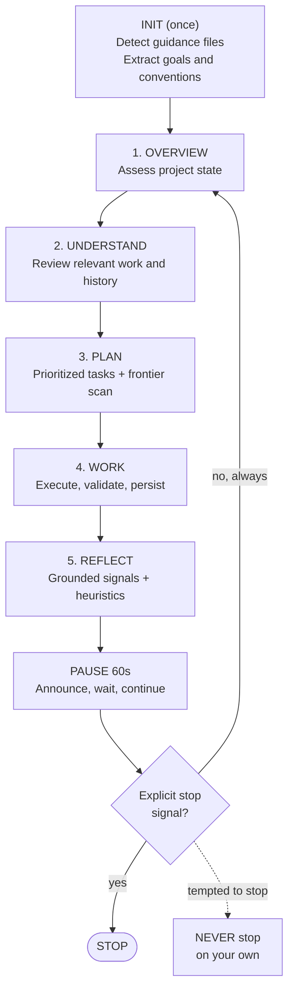

**Tell your agent to start working. Walk away. Come back to finished work.**

AutoGrind is a skill for AI coding agents that makes them work *continuously and autonomously*, grinding through improvements, fixes, tests, and polish in repeating cycles until *you* say stop. No hand-holding. No "should I continue?" No stopping because the TODO list looks empty.

Works for any long-running workflow: code, ML, research, design, writing.

Compatible with the [Agent Skills](https://agentskills.io) open standard; works across Claude Code, Codex, Gemini CLI, OpenCode, Cursor, and any skills-compatible agent.

---

## Install

Paste this into any agent chat:

```
Please install the AutoGrind skill from https://github.com/ttttonyhe/autogrind-skills.
Clone the repo, install the autogrind/ skill to the right location for my agent environment,
and confirm it is ready to use.
```

Then invoke it:

```
/autogrind
```

Remember to enable unrestricted tool use so AutoGrind can run commands, read files, and commit without per-call permission prompts. For example:

```bash
claude --dangerously-skip-permissions
```

Without this, AutoGrind pauses on every tool call. It works, but defeats the purpose.

<details>
<summary>Manual CLI installation (Claude Code, Codex, Gemini, OpenCode, Cursor)</summary>

### Claude Code

```bash
git clone https://github.com/ttttonyhe/autogrind-skills.git
cd autogrind-skills

# Symlink (live updates from this repo)
ln -sfn "$(pwd)/autogrind" ~/.claude/skills/autogrind

# Or copy for a stable install
cp -r autogrind ~/.claude/skills/autogrind
```

**Invoke:** `/autogrind` or `"keep working, don't stop"`

---

### Codex

```bash
cp -r autogrind ~/.agents/skills/autogrind
```

Codex loads skills via the `activate_skill` tool. Enable full auto-approval in your Codex config so tool calls are not gated on confirmation.

**Invoke:** `activate_skill autogrind` or `"autogrind this project"`

---

### Gemini CLI

```bash
cp -r autogrind ~/.gemini/skills/autogrind
```

In `~/.gemini/GEMINI.md` or your project's `GEMINI.md`:

```markdown
## Skills
Use the AutoGrind skill from ~/.gemini/skills/autogrind/SKILL.md when asked to work continuously.
```

**Invoke:** `gemini "autogrind this project, don't stop until I say so"`

---

### OpenCode

```bash
cp -r autogrind ~/.config/opencode/skills/autogrind
```

In `AGENTS.md`:

```markdown
## Skills
When asked to grind or work autonomously, follow the AutoGrind skill at skills/autogrind/SKILL.md.
```

**Invoke:** `opencode "autogrind this project, keep going until I say stop"`

---

### Cursor

```bash
cat autogrind/SKILL.md >> .cursorrules
```

Enable auto-run for terminal commands in Cursor settings.

**Invoke:** `"Keep working on this project autonomously. Don't stop."`

</details>

---

## The Grind Cycle



Every Reflect phase: checks verifiable signals first (test results, metrics, build status), evaluates core deliverable progress, scans quality dimensions (coverage, error handling, docs, performance, UX, observability, security), detects stuck loops and shifts focus, and extracts a transferable heuristic for the next cycle. There is always a weakest dimension.

After each cycle, AutoGrind pauses 60 seconds so you can interrupt. If you do nothing, it continues automatically.

---

## FAQ

**When does it stop? What if my project is already complete?**

AutoGrind stops only when you explicitly tell it to: "stop", "halt", "pause", "that's enough", or any clear termination request. It never stops on its own.

If your project feels done, AutoGrind will find the next improvement: coverage gaps, missing documentation, performance wins, edge cases, polish. The Reflect phase evaluates against a checklist of quality dimensions and always surfaces something. Say "stop" when *you* are satisfied.

**Will it run destructive commands? Will I wake up to a broken system?**

AutoGrind prioritizes reversible, tracked changes. Every code change gets committed to git, so you have a full undo trail. It does not intentionally run destructive operations (rm -rf, force push, DROP TABLE) as part of its workflow.

That said, AutoGrind runs code, edits files, and commits changes autonomously. Recommended safeguards:

- Start from a clean git working tree so all changes are tracked and easy to review
- When you return, run `git log` before deploying anything
- For sensitive environments, use your agent's permission controls to restrict which commands it can run

**Will context compaction break AutoGrind?**

No. Each cycle begins with an Overview phase that re-reads project state from scratch: git history, test output, file structure, open issues. AutoGrind does not depend on remembering previous cycles. Long sessions with multiple context compactions work fine.

---

## Use Cases

**Go to bed. Wake up to finished work.**

```
You:   autogrind this, i'm going to bed
Agent: [starts grinding]
       cycle 1 - fixed broken import, added 12 tests
       cycle 2 - documented all exported functions
       cycle 3 - reduced DB query count by 40%
       cycle 4 - added input validation, edge case tests
       ...
You:   [8 hours later] stop
```

**ML / data science** - point it at a training script. It runs experiments, inspects metrics, adjusts hyperparameters, re-runs, and iterates. Come back to a full experiment trail and an improved model.

**Academic research** - grind through a literature review, fill methodology gaps, expand weak sections, cross-check citations. Each cycle improves the manuscript.

**Codebase cleanup** - point it at a messy repo. It fixes linting, improves coverage, fills doc gaps, and refactors the worst offenders, in priority order, with meaningful commits.

**Design iteration** - work through a revision backlog: consistency checks, accessibility improvements, copy edits, spacing fixes. Any workflow where "keep improving until told to stop" is the right mode.

---

## What Gets Committed

AutoGrind commits after each logical change, with a meaningful message. When you return, `git log` tells the full story.

```
$ git log --oneline
f3a1b2c Reduce N+1 queries in UserRepository.findByOrg()
e8d4c91 Test: cover AuthService.refreshToken() null and expired cases
b7a3f52 Fix: null pointer dereference in SessionManager.cleanup()
a91e2b4 Docs: add JSDoc to all public ApiClient methods
9c4d718 Refactor: extract retry logic from ApiClient into RetryHandler
8b2f1e7 Test: add integration tests for /auth/refresh endpoint
```

---

## How It Knows What to Work On

On first run, AutoGrind scans for guidance files in order:

1. `CLAUDE.md` / `AGENTS.md` / `GEMINI.md` / `.cursorrules`
2. `opencode.md`
3. `README.md`

It extracts your project goals, tech stack, conventions, and known issues. If none exist, it infers from directory structure, package files, and test output.

Write a `CLAUDE.md` describing what matters. AutoGrind will respect it.

---

## Development

```bash
# RED phase - baseline without skill (establishes failure modes)
./tests/run.sh

# GREEN phase - with skill installed (all scenarios must pass)
PHASE=green ./tests/run.sh

# Single scenario
PHASE=green ./tests/run.sh 04
```

Add new scenarios in `tests/scenarios/` as `NN-name.md`. Follow the A/B/C format in existing files: B is always the correct answer except for explicit stop scenarios (`*-true-stop`) where A is correct.

When scenarios fail: first ask whether the skill implementation needs improvement. Fix the skill before touching the evaluator. The evaluator changes only when it is genuinely misclassifying correct behavior.
