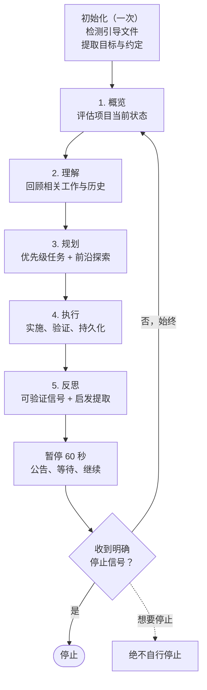

**一句话让你的智能体开始自主工作，彻底放手。回来时，工作已完成。**

AutoGrind 是一个专为 AI 智能体设计的技能，让它们**持续自主地**工作——不断修复问题、改进、完善测试、精细打磨，周而复始，直到**你**说停为止。不用手把手引导，不会问"需要继续吗"，不会因为 TODO 列表看起来空了就自己停下来。

适用于任何长时间运行的工作流：代码开发、机器学习、学术研究、设计、写作。

兼容 [Agent Skills](https://agentskills.io) 开放标准；适用于 Claude Code、Codex、Gemini CLI、OpenCode、Cursor、Windsurf、Roocode、Cline、Trae、Kimi Code、GitHub Copilot、Goose、AmpCode、Kilo、Kiro、Factory、Hermes Agent 及所有兼容智能体。

[English](README.md) | 简体中文

---

## 安装

将以下内容粘贴到任意智能体的聊天框中：

```
请从 https://github.com/ttttonyhe/autogrind 安装 AutoGrind 技能。
克隆仓库，将技能安装到我的智能体环境对应的位置，
并确认已准备就绪。
```

然后调用：

```
/自己动
```

如果你使用 Claude Code 或 Codex，并且更偏好原生插件形态，请查看[插件安装指南](PLUGIN.md)。

建议开启不受限制的工具权限，这样 AutoGrind 才能无需每次手动确认，直接执行命令、读取文件并提交代码。例如：

```bash
claude --dangerously-skip-permissions
```

若不开启，AutoGrind 每次调用工具都会暂停等待确认，自主运行便形同虚设。

<details>
<summary>手动安装（Claude Code、Codex、Gemini CLI、OpenCode、Cursor 等）</summary>

### 通用安装（所有智能体）

所有兼容 agentskills.io 的智能体都会自动从 `~/.agents/skills/` 目录发现技能。安装一次，所有智能体通用：

```bash
# 直接克隆到技能目录（稳定版本）
git clone --depth 1 https://github.com/ttttonyhe/autogrind.git ~/.agents/skills/autogrind

# 或符号链接（实时同步仓库更新）
git clone https://github.com/ttttonyhe/autogrind.git
ln -sfn "$(pwd)/autogrind" ~/.agents/skills/autogrind
```

---

### Claude Code

```bash
# 直接克隆到技能目录（稳定版本）
git clone --depth 1 https://github.com/ttttonyhe/autogrind.git ~/.claude/skills/autogrind

# 或符号链接（实时同步仓库更新）
ln -sfn "$(pwd)" ~/.claude/skills/autogrind
```

**调用方式：** `/自己动` 或 `/autogrind` 或"持续工作，不要停"

可选原生插件安装：

```bash
claude plugin marketplace add ttttonyhe/autogrind && claude plugin install autogrind@autogrind
```

---

### Codex

推荐的原生插件安装方式：在 Codex 中打开本仓库，打开 `plugins`，然后从 AutoGrind marketplace 安装 `autogrind`。完整说明见 [PLUGIN.md](PLUGIN.md)。

如果你只是想直接安装原始技能，或做本地技能开发/测试，也可以继续使用下面的方式：

```bash
git clone --depth 1 https://github.com/ttttonyhe/autogrind.git ~/.agents/skills/autogrind
```

Codex 会自动从 `~/.agents/skills/` 发现原始技能。请在 Codex 配置中开启完全自动审批，以免工具调用被中途拦截。

**调用方式：** `"自主运行这个项目"` 或 `"持续工作，不要停"`

---

### Gemini CLI

```bash
git clone --depth 1 https://github.com/ttttonyhe/autogrind.git ~/.gemini/skills/autogrind
# 或使用通用路径：~/.agents/skills/autogrind
```

Gemini CLI 会自动从 `~/.gemini/skills/` 目录发现技能，无需手动配置 GEMINI.md。本地开发可使用 `gemini skills link` 创建符号链接。

**调用方式：** `gemini "自主运行这个项目，不要停"`

---

### OpenCode

```bash
git clone --depth 1 https://github.com/ttttonyhe/autogrind.git ~/.agents/skills/autogrind
# 或：~/.claude/skills/autogrind（OpenCode 两个路径都会检查）
```

OpenCode 自动发现技能，无需手动配置 AGENTS.md。

**调用方式：** `opencode "自主运行这个项目，持续工作直到我说停"`

---

### Cursor

```bash
git clone --depth 1 https://github.com/ttttonyhe/autogrind.git ~/.cursor/skills/autogrind
# 或使用通用路径：~/.agents/skills/autogrind
```

在 Cursor 设置中开启终端命令自动运行。

**调用方式：** `"自主地持续改进这个项目，不要停下来。"`

---

### Windsurf

```bash
# 推荐路径
git clone --depth 1 https://github.com/ttttonyhe/autogrind.git ~/.codeium/windsurf/skills/autogrind
# 或通用路径
git clone --depth 1 https://github.com/ttttonyhe/autogrind.git ~/.agents/skills/autogrind
```

**调用方式：** `"autogrind 这个项目，不要停"`

---

### Roocode

```bash
# 推荐路径
git clone --depth 1 https://github.com/ttttonyhe/autogrind.git ~/.roo/skills/autogrind
# 或通用路径
git clone --depth 1 https://github.com/ttttonyhe/autogrind.git ~/.agents/skills/autogrind
```

**调用方式：** `"持续工作，不要停"`

---

### Cline

```bash
# 推荐路径
git clone --depth 1 https://github.com/ttttonyhe/autogrind.git ~/.cline/skills/autogrind
# 或通用路径
git clone --depth 1 https://github.com/ttttonyhe/autogrind.git ~/.agents/skills/autogrind
```

**调用方式：** `"autogrind 这个项目，持续运行"`

---

### Trae（字节跳动）

```bash
# 推荐路径
git clone --depth 1 https://github.com/ttttonyhe/autogrind.git ~/.trae/skills/autogrind
# 或通用路径
git clone --depth 1 https://github.com/ttttonyhe/autogrind.git ~/.agents/skills/autogrind
```

**调用方式：** `"自己动，不要停"` 或 `/autogrind`

---

### Kimi Code（月之暗面）

```bash
git clone --depth 1 https://github.com/ttttonyhe/autogrind.git ~/.config/agents/skills/autogrind
# 或项目级别
git clone --depth 1 https://github.com/ttttonyhe/autogrind.git .kimi/skills/autogrind
```

**调用方式：** `/skill:autogrind` 或 `"持续工作，不要停"`

---

### GitHub Copilot

```bash
# 推荐路径
git clone --depth 1 https://github.com/ttttonyhe/autogrind.git ~/.copilot/skills/autogrind
# 或通用路径
git clone --depth 1 https://github.com/ttttonyhe/autogrind.git ~/.agents/skills/autogrind
```

在 `.github/copilot-instructions.md` 中加入项目上下文，配合 AutoGrind 效果更佳。

**调用方式：** `"autogrind 模式，持续工作"` 或 `/autogrind`

---

### Goose

```bash
git clone --depth 1 https://github.com/ttttonyhe/autogrind.git ~/.agents/skills/autogrind
```

**调用方式：** `"autogrind 这个项目，持续运行"`

---

### AmpCode

```bash
# 推荐路径
git clone --depth 1 https://github.com/ttttonyhe/autogrind.git ~/.config/agents/skills/autogrind
# 或通用路径
git clone --depth 1 https://github.com/ttttonyhe/autogrind.git ~/.agents/skills/autogrind
```

**调用方式：** `"自己动，不要停"`

---

### Kilo / Kiro / Factory

```bash
git clone --depth 1 https://github.com/ttttonyhe/autogrind.git ~/.agents/skills/autogrind
```

以上智能体均支持 agentskills.io 通用路径，安装后直接调用即可。

**调用方式：** `"持续工作，不要停"` 或 `"autogrind 模式"`

---

### Hermes Agent（NousResearch）

```bash
git clone --depth 1 https://github.com/ttttonyhe/autogrind.git ~/.agents/skills/autogrind
```

**调用方式：** `"autogrind 这个项目，持续运行"`

</details>

### 通过插件安装

如果你更喜欢 Claude Code 或 Codex 的原生插件体验，请使用 [PLUGIN.md](PLUGIN.md) 中的安装方式。两个原生插件都只是围绕同一份 `autogrind` 技能的包装层。

---

## 更新

将以下内容粘贴到任意智能体的聊天框中：

```
请将 AutoGrind 技能更新到 https://github.com/ttttonyhe/autogrind 的最新版本。
```

<details>
<summary>手动更新</summary>

```bash
# 如果是符号链接安装——在源仓库中执行 git pull 即可。

# 如果是 git clone 安装，在安装目录中执行：
cd ~/.claude/skills/autogrind && git pull    # Claude Code
cd ~/.agents/skills/autogrind && git pull    # 通用 / Codex / Gemini / OpenCode / Cursor
```

</details>

---

## 磨砺循环



每个反思阶段：先核查可验证信号（测试结果、指标、构建状态），评估核心交付物进展，扫描各质量维度（覆盖率、错误处理、文档、性能、用户体验、可观测性、安全性），识别重复卡点并及时转向，再为下一轮循环提炼可复用的经验原则。总有可以做得更好的地方。

每个循环结束后，AutoGrind 会暂停 60 秒，给你留出中断的机会。什么都不做的话，它会自动继续。

---

## 常见问题

**它什么时候停止？如果项目已经完成了怎么办？**

AutoGrind 只在你明确告知时停止："停"、"停止"、"暂停"、"够了"、"结束"，或任何清晰的终止指令。它绝不会自行停止。

如果你觉得项目已经完成，AutoGrind 会继续寻找下一处改进点：测试覆盖盲区、文档缺失、性能优化空间、边缘情况处理、代码打磨。反思阶段会逐一对照质量维度清单，总能找到可以做得更好的地方。等**你**满意了，说"停"就行。

**它会执行破坏性命令吗？我回来会不会发现项目一团糟？**

AutoGrind 优先执行可逆的、有版本追踪的变更。每次代码变更都会提交到 git，保留完整的撤销记录。它不会主动执行破坏性操作（如 `rm -rf`、强制推送、`DROP TABLE`）。

即便如此，AutoGrind 仍会自主运行代码、编辑文件、提交变更。建议的防护措施：

- 从干净的 git 工作区开始，确保所有变更都有追踪记录，方便事后审查
- 回来后先看 `git log`，再部署任何内容
- 对于敏感环境，通过智能体的权限控制来限制可执行的命令范围

**上下文压缩会影响 AutoGrind 吗？**

不会。每个循环开始时，概览阶段都会从头重新读取项目状态：git 历史、测试输出、文件结构、待处理问题。AutoGrind 不依赖对前几轮循环的记忆。即便会话中经历多次上下文压缩，也能正常运行。

---

## 使用场景

**去睡觉。醒来时工作已经完成。**

```
你：   自己动，我去睡觉了
智能体：[开始持续工作]
       循环 1 - 修复了损坏的导入，新增 12 个测试
       循环 2 - 为所有导出函数添加文档
       循环 3 - 减少 40% 的数据库查询次数
       循环 4 - 添加输入验证，补充边缘情况测试
       ...
你：   [8 小时后] 停
```

**机器学习 / 数据科学** — 把它指向训练脚本，它会自动运行实验、查看指标、调整超参数、反复迭代。回来时，面前是完整的实验记录和更优的模型。

**学术研究** — 推进文献综述、填补方法论空白、扩充薄弱章节、交叉核对引用。每轮循环都在改进手稿。

**代码库清理** — 把它指向一个混乱的代码仓库。它会按优先级修复 lint 问题、提升覆盖率、补充文档缺口、重构最糟糕的部分，每次提交都言之有物。

**设计迭代** — 处理修改积压：一致性检查、无障碍改进、文案修改、间距修正。任何"持续改进直到叫停"的工作流都适用。

---

## 提交内容

AutoGrind 在每次逻辑变更后提交，并附上有意义的提交信息。等你回来，打开 `git log`，所有工作一目了然。

```
$ git log --oneline
f3a1b2c 减少 UserRepository.findByOrg() 的 N+1 查询
e8d4c91 测试：覆盖 AuthService.refreshToken() 的空值和过期情况
b7a3f52 修复：SessionManager.cleanup() 中的空指针解引用
a91e2b4 文档：为所有公共 ApiClient 方法添加 JSDoc
9c4d718 重构：将重试逻辑从 ApiClient 提取到 RetryHandler
8b2f1e7 测试：为 /auth/refresh 端点添加集成测试
```

---

## 工作方向来源

首次运行时，AutoGrind 按顺序扫描引导文件：

1. `CLAUDE.md` / `AGENTS.md` / `GEMINI.md` / `.cursorrules`
2. `opencode.md`
3. `README.md`

它会提取你的项目目标、技术栈、约定和已知问题。如果以上文件都不存在，则从目录结构、包文件和测试输出中自行推断。

写一份 `CLAUDE.md`（或对应的引导文件），描述项目的关键信息，AutoGrind 会严格遵照执行。

---

## 开发

```bash
# 验证技能结构
npx skills-ref validate skills/autogrind

# 对单个评估用例进行评分
python3 tests/grade-evals.py --response <响应文件> --eval-id <N>

# 批量评分（responses-dir 目录须包含 eval-<N>.txt 文件）
python3 tests/grade-evals.py --all --responses-dir <目录>

# 并行评分以加快批量运行（推荐 5-10 个 worker）
python3 tests/grade-evals.py --all --responses-dir <目录> --workers 8

# 盲测对比两份响应的整体质量（含技能 vs 不含技能）
python3 tests/blind-compare.py --response-a <文件A> --response-b <文件B> --eval-id <N>

# 将评分结果汇总为 benchmark.json
python3 tests/aggregate-benchmark.py --iteration-dir <workspace/iteration-N/>
```

评估用例位于 `evals/evals.json`（61 条），JSON Schema 位于 `evals/evals.schema.json`（IDE 可自动校验格式）。描述词触发测试查询位于 `evals/train_queries.json` 和 `evals/validation_queries.json`。完整评估流程（运行、评分、盲测对比、汇总、分析、人工审阅、迭代）详见 `CLAUDE.md`。

评估失败时：先审视技能实现本身是否有待改进。优先修复技能，再考虑修改断言。断言只有在对正确行为产生误判时，才有必要修改。
