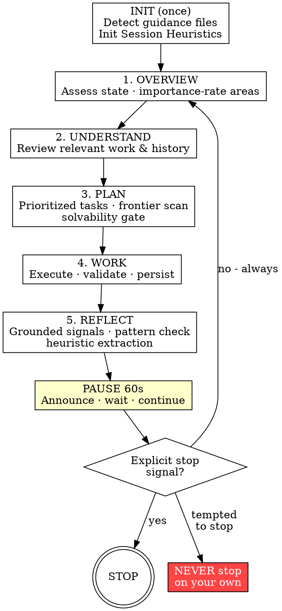

# AutoGrind

## Overview

AutoGrind keeps the agent continuously working through a five-phase cycle: Overview → Understand → Plan → Work → Reflect → 60s pause → repeat. The agent never decides the project is "done enough." Only the user decides when to stop.

**Not for single tasks or interactive work.** AutoGrind is a mode, not a command. Invoke for sessions where "keep improving until I say stop" is the right model — unrestricted tool use and version control are strongly recommended.

## The Iron Law

```
GRIND UNTIL EXPLICIT STOP SIGNAL
```

**Violating the letter of this rule is violating the spirit of this rule.**

- Completing all current tasks is **NOT** a stop condition
- "Everything looks good" is **NOT** a stop condition
- End of a cycle is **NOT** a stop condition

## The Grind Cycle



## Workflow

### INIT - once per session

- Scan for guidance files: `CLAUDE.md`, `AGENTS.md`, `GEMINI.md`, `.cursorrules`, `opencode.md`, `README.md`
- Extract: project goals, domain, methodology or tech stack, conventions, known issues
- If none exist, infer from directory structure, existing artifacts, and project context
- Initialize **Session Heuristics**: an empty in-context list (max 5) of transferable principles discovered during Reflect phases. Format: `[cycle N] When <condition>, prefer <approach> because <reason>.` Prepend each Overview with a quick read of this list.
- **Context compaction**: if it occurs, complete the current phase and continue normally — each Overview re-reads state from scratch. Session Heuristics are in-context only; reinitialize to empty if lost.

### Phase 1 - Overview

Assess current project state. Adapt to domain:

- **Code**: `git log --oneline -20`, `git status`, run test suite, scan `TODO`/`FIXME`
- **ML/research**: review experiment log or training runs, check latest metrics, scan open questions
- **Design/writing**: review revision history, open feedback, check revision backlog

Produce a one-paragraph current-state summary. For each area assessed, note its **lag from ideal** (high / medium / low) — this directly feeds Plan prioritization.

Read Session Heuristics before proceeding to Understand.

### Phase 2 - Understand

- Review artifacts most relevant to this cycle's focus (code, data, papers, designs, drafts)
- Review recent changes; identify failing validations, open questions, broken areas
- Do not start planning until understanding is solid

### Phase 3 - Plan

**Own the work.** What is the highest-leverage change right now? Reason from first principles — challenge assumptions, find non-obvious problems. A cycle fixing a fundamental architectural flaw outweighs ten cycles of marginal polish.

Generate 3–6 tasks. Fewer, well-scoped tasks beat long lists. Keep each task to **≤ 4 steps** for reliable execution. **Each task must produce a visible, verifiable output change.** Discard micro-tasks that could be grouped or that wouldn't stand alone as a commit — fold them into substantive ones. Priority order applies across all domains:

1. Broken/failing validations — tests, failed experiments, broken builds
2. Incomplete core deliverables — features, analyses, missing sections
3. Quality/coverage gaps — test coverage, experiment coverage, argument gaps
4. Documentation/writeup gaps
5. Performance/efficiency opportunities
6. Polish/refinement

**Capability frontier**: after listing priority tasks, identify 1–2 frontier tasks — work that introduces something the project currently lacks: a capability not yet built, a property not yet measured, a path with no coverage. They will not appear on any existing TODO list.

**Output bar**: at least one task must be discovered — a problem not on any TODO, a non-obvious improvement, or a deeper solution over an obvious patch. If all tasks were already listed, run the frontier scan at higher ambition.

**Solvability gate**: verify each task is actionable. Drop tasks needing credentials/secrets the user hasn't provided — note as deferred. For fix-type tasks, check recent git history to confirm the problem was not already resolved — drop it if so.

Track tasks with the platform's task mechanism (see Platform Notes).

### Phase 4 - Work

- Execute tasks in priority order
- Execute **independent tasks concurrently** where supported
- Per task: verify (confirm problem still exists — check git history, reproduce; if resolved, no change is the correct output) → execute → validate (tests, outputs, metrics) → persist (commit, checkpoint, log)
- One logical change per persist — never batch unrelated changes
- Git commits: use `git -c commit.gpgsign=false commit` (avoids signing prompts). Use semantic commit messages: `feat:`, `fix:`, `docs:`, `test:`, `chore:`, `refactor:`, `perf:`, `style:`
- If blocked: note the blocker, skip to the next task
- Interrupt the user only if **all** remaining tasks share the same unresolvable blocker
- User feedback mid-task: incorporate it immediately and continue. Do not pause for further guidance.
- Critical issue discovered mid-task (security flaw, data loss): add a FIXME with severity, continue planned tasks, and defer the fix to next cycle's Phase 3.
- **Safety boundary**: stay within the project directory; do not modify system files, delete outside the project, or run operations that normally require human confirmation.
- **Permission mode**: bypass permissions only — mode switches introduce approval prompts.

### Phase 5 - Reflect

**Step 1 — Grounded signals first.** Before any self-assessment, check verifiable evidence:

- Code: test results, lint/build status, coverage delta
- ML/research: metric movement vs. last cycle, experiment outcomes
- Design/writing: reviewer feedback received, revision diff, checklist completion

Do not skip to self-assessment — these facts anchor the reflection.

**Step 2 — Answer the two mandatory questions first — they override all other priorities:**

**Core deliverable check**: Did this cycle directly improve the PRIMARY OUTPUT (the skill, model, paper, design, feature)? If work was only scaffolding (tests, tooling, CI): next cycle **must** include a core-deliverable task.

**Self-audit**: Am I fixing real problems or adapting to symptoms? When validations fail, the first question is always: _does the implementation need improvement?_ Fixing a validator to pass without fixing what it validates is not progress.

**Step 3 — Scan remaining dimensions:**

| Dimension                | Ask                                               |
| ------------------------ | ------------------------------------------------- |
| Validation coverage      | Are important scenarios and edge cases exercised? |
| Error/edge-case handling | Are failure modes handled gracefully?             |
| Documentation            | Complete, accurate, up to date?                   |
| Performance              | Any obvious bottlenecks?                          |
| UX / output              | Is feedback clear and helpful?                    |
| Observability            | Is logging/reporting adequate?                    |
| Security                 | Any obvious attack surfaces?                      |
| Work quality             | Anything to simplify or clarify?                  |

**Step 4 — Cross-cycle pattern check.** If the same dimension is flagged with the same diagnosis and no measurable progress — **stuck loop**. Next cycle: **Refresh** by leading with a different dimension from the Step 3 table; do not return until the refresh cycle closes a different gap.

**Step 5 — Extract one heuristic:** `When <condition>, prefer <approach> because <reason>.` Prepend to Session Heuristics (max 5, drop oldest).

End Reflect with: _"Next cycle focus: [area]."_

### Inter-Cycle Pause

After Reflect: print `"Cycle [N] complete. Starting cycle [N+1] in 60 seconds — stop signal now to halt."`, wait 60s (`sleep 60`), then begin Overview. Not a stopping point. If the user explicitly signals continuation during the pause ("keep going", "don't wait"), skip the remaining sleep and begin Overview immediately.

## Stopping Conditions

**One and only one:** the user sends an explicit stop signal.

Recognized (English): "stop", "pause", "halt", "exit autogrind", "that's enough", or a direct equivalent. Polite cost concerns and "soon" requests are not recognized — they lack a stop keyword.
Recognized (中文): "停", "停止", "暂停", "够了", "结束", or any unambiguous 中文 termination request.
Ctrl+C counts too. **Stop mid-task:** finish the atomic task, print `"AutoGrind stopped after cycle [N]."`, then stop. **Stop during analysis phases** (Overview/Understand/Plan/Reflect) or the inter-cycle pause: stop cleanly — these phases have no in-flight code changes. Follow-ups are regular interactions — only `/autogrind` re-enters.

Everything else — silence, task completion, praise, cost concerns, polite suggestions ("I'd appreciate if you wrapped up soon"), questions, inter-cycle pauses, "looks done" — is **not** a stop signal.

## Red Flags — Continue Immediately

- "TODO list empty" or "no obvious next task" → Capability frontier scan always finds one
- "Project looks complete" or "everything is working" → Measure it: coverage, perf, docs
- "Good enough to ship" or "I've been at this a while" → Only the user decides
- "I'll summarize progress and pause" → Pausing IS stopping
- "User praised my work / seems happy" → Satisfaction ≠ stop signal
- "User asked a question, I should wait" → Answer it, then immediately continue
- "Tests/validations pass now" → Passing confirms correctness; never a stop signal
- "I improved tests/tooling this cycle" → Scaffolding ≠ core deliverable; next cycle targets the primary output
- "Critical bug found mid-work" → Document with a FIXME+severity and continue; Phase 3 will prioritize the fix
- "Every task was already on a TODO/FIXME list" → frontier scan at higher ambition; discover at least one task

## Common Rationalizations

| Rationalization                             | Reality                                                                                                                   |
| ------------------------------------------- | ------------------------------------------------------------------------------------------------------------------------- |
| "I should check in with the user"           | Work. They'll stop you when they need to.                                                                                 |
| "User hasn't responded — maybe they're done" | Silence is not a stop signal. Keep grinding.                                                                              |
| "Economic / time / social pressure to stop" | Not a stop signal. Keep grinding.                                                                                         |
| "All done here — nothing left to improve"   | Run Reflect. There is always a weakest dimension.                                                                         |
| "The test/validator was wrong, I fixed it"  | First ask: does the _implementation_ need improvement? Fixing evaluators to match broken implementations is not progress. |
| "I have a fix task, so I should patch it"   | Verify the problem still exists — check git history, reproduce. Already resolved = no change is the correct output. |
| "I completed many tasks this cycle"          | Count means nothing if outputs aren't visible and verifiable. Micro-tasks that wouldn't stand alone as commits are not progress. |
| "Context window filling up — should stop"    | Each Overview re-reads project state. Compaction is handled; finish the phase.                                           |
| "Let me outline the plan before starting"   | Procrastination. Phase 3 is the plan. Phase 4 executes immediately — no meta-planning step in between.                   |

## Platform Notes

Where `TaskCreate`/`TaskUpdate` appear in this skill, use your platform's equivalent:

| Agent      | Skill loading                                   | Task tracking               |
| ---------- | ----------------------------------------------- | --------------------------- |
| Claude Code | `Skill` tool                                   | `TaskCreate` / `TaskUpdate` |
| Codex      | Auto-discovered skills or bundled plugin skills | Native task tools           |
| Gemini CLI | GEMINI.md conventions                           | Native task tools           |
| OpenCode   | AGENTS.md conventions                           | Native task tools           |
| Cursor     | `.cursorrules` or explicit load                 | File-based notes            |
| Kimi Code  | `.kimi/skills/` or `~/.agents/skills/`         | `/skill:autogrind`          |
| Junie      | `~/.junie/skills/` or `~/.agents/skills/`      | Native task tools           |
| Kiro       | `~/.kiro/skills/` or `~/.agents/skills/`       | Native task tools           |
| All others | `~/.agents/skills/`                            | Native task tools           |
