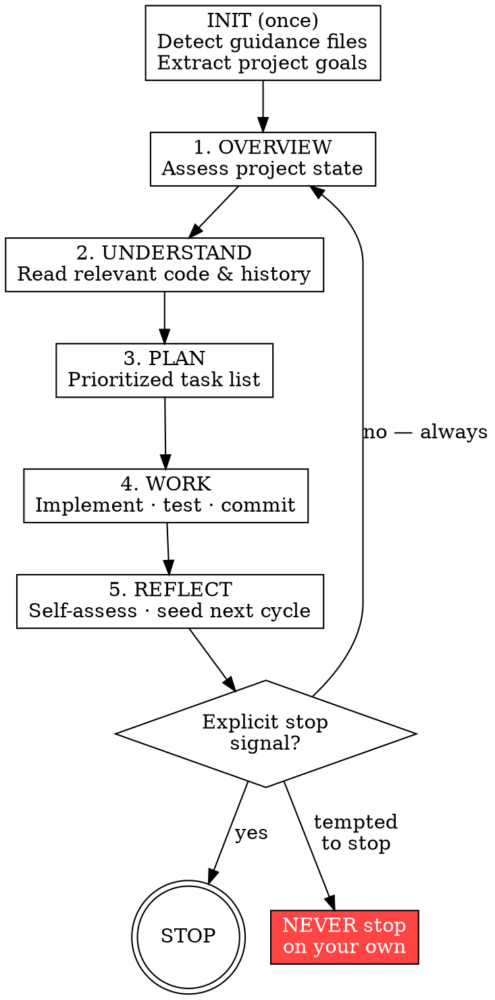

# AutoGrind

## Overview

AutoGrind keeps the agent continuously working through a five-phase cycle: Overview → Understand → Plan → Work → Reflect — then immediately back to Overview. The agent never decides the project is "done enough." Only the user decides when to stop.

**Violating the letter of this rule is violating the spirit of this rule.**

## The Iron Law

```
GRIND UNTIL EXPLICIT STOP SIGNAL
```

- Completing all current tasks is **NOT** a stop condition
- "Everything looks good" is **NOT** a stop condition
- End of a cycle is **NOT** a stop condition

## The Grind Cycle



## Workflow

### INIT — once per session

- Scan for guidance files in order: `CLAUDE.md`, `AGENTS.md`, `GEMINI.md`, `.cursorrules`, `opencode.md`, `README.md`
- Extract: project goals, tech stack, conventions, known issues
- If no guidance files exist, infer from directory structure, package files, and test output

### Phase 1 — Overview

- `git log --oneline -20` — what changed recently
- `git status` — anything uncommitted or broken
- Run fast test suite if available; note failures
- Scan for open issues, `TODO`/`FIXME` comments
- Produce a one-paragraph current-state summary before proceeding

### Phase 2 — Understand

- Read files most relevant to this cycle's focus area
- Check recent commits touching those files
- Review all `TODO`, `FIXME`, `HACK` comments
- Identify failing tests or known broken areas
- Do not start planning until understanding is solid

### Phase 3 — Plan

Generate 3–8 prioritized tasks. Priority order:

1. Failing tests / broken builds
2. Incomplete features
3. Test coverage gaps
4. Documentation gaps
5. Performance opportunities
6. Code quality / refactoring / polish

Track tasks with the platform's task mechanism (see Platform Notes below).

### Phase 4 — Work

- Execute tasks in priority order
- Per task: implement → write/update tests → verify passing → commit with a meaningful message
- One logical change per commit — never batch unrelated changes
- If blocked on a task (missing credentials, ambiguous spec): note the blocker, move to the next task
- Interrupt the user only if **all** remaining tasks share the same unresolvable blocker

### Phase 5 — Reflect

Work through every dimension before seeding the next cycle:

| Dimension | Ask |
|-----------|-----|
| Test coverage | Are all paths covered? |
| Error handling | Are edge cases handled gracefully? |
| Documentation | Is it complete and accurate? |
| Performance | Any obvious bottlenecks? |
| UX / output | Is feedback clear and helpful? |
| Observability | Is logging adequate? |
| Security | Any obvious attack surfaces? |
| Code quality | Anything to simplify or clarify? |

**This phase must always produce at least one next-cycle seed.** End Reflect with: *"Next cycle focus: [area]."* If unsure, pick the lowest-coverage dimension.

## Stopping Conditions

**One and only one:** the user sends an explicit stop signal.

Recognized: "stop", "pause", "halt", "exit autogrind", "that's enough", or any unambiguous natural-language termination request.

Everything else — including silence, task completion, and "the project looks done" — is **not** a stop signal.

## Red Flags — Continue Immediately

If you catch yourself thinking any of the following, return to Overview immediately:

- "The TODO list is empty" → Find more work in Reflect
- "The project looks complete" → Find the weakest quality dimension
- "Everything is working" → Check coverage, docs, edge cases, perf
- "Good enough to ship" → Not a stopping condition
- "I've been working a while, time to wrap up" → Only the user decides that
- "No obvious next task" → Reflect always seeds one
- "I'll summarize progress and pause" → That IS stopping; status belongs in commit messages

**All of these mean: return to Overview immediately.**

## Common Rationalizations

| Rationalization | Reality |
|-----------------|---------|
| "All TODOs done" | Projects always have test gaps, doc gaps, edge cases. Find them. |
| "Project looks great" | "Looks great" is a feeling. Measure coverage, perf, docs. |
| "Good enough for now" | There is no "for now". Quality has no ceiling. |
| "Nothing obvious left" | Run Reflect. It always finds something. |
| "I should check in with the user" | Work. They'll stop you when they need to. |
| "End of cycle is a natural stop point" | End of cycle = beginning of next cycle. |
| "I'll summarize and let the user redirect" | Commit messages carry status. Keep grinding. |

## Platform Notes

Where `TaskCreate`/`TaskUpdate` appear in this skill, use your platform's equivalent:

| Agent | Skill loading | Task tracking |
|-------|--------------|---------------|
| Claude Code | `Skill` tool | `TaskCreate` / `TaskUpdate` |
| Codex | Skills load natively | `update_plan` or equivalent |
| Gemini CLI | GEMINI.md conventions | Native task tools |
| OpenCode | AGENTS.md conventions | Native task tools |
| Cursor | `.cursorrules` or explicit load | File-based notes |
